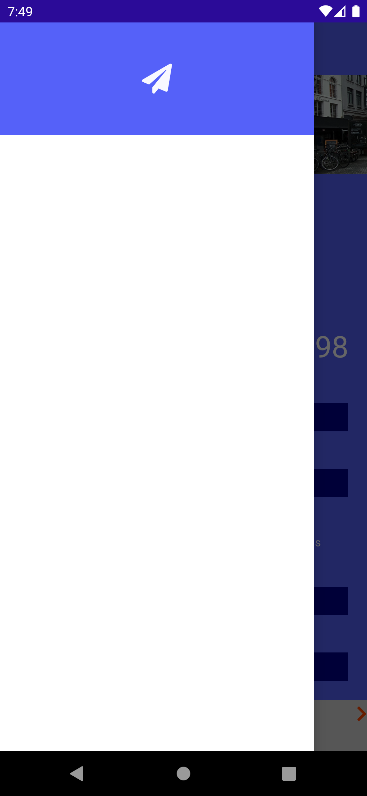
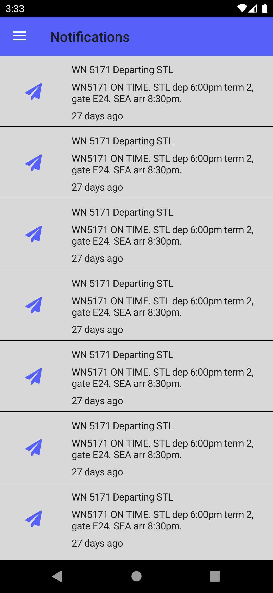
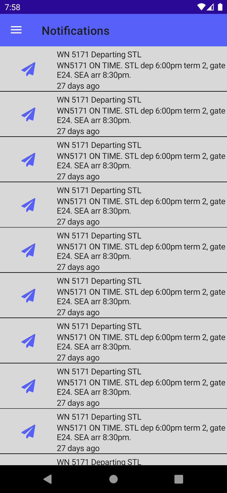
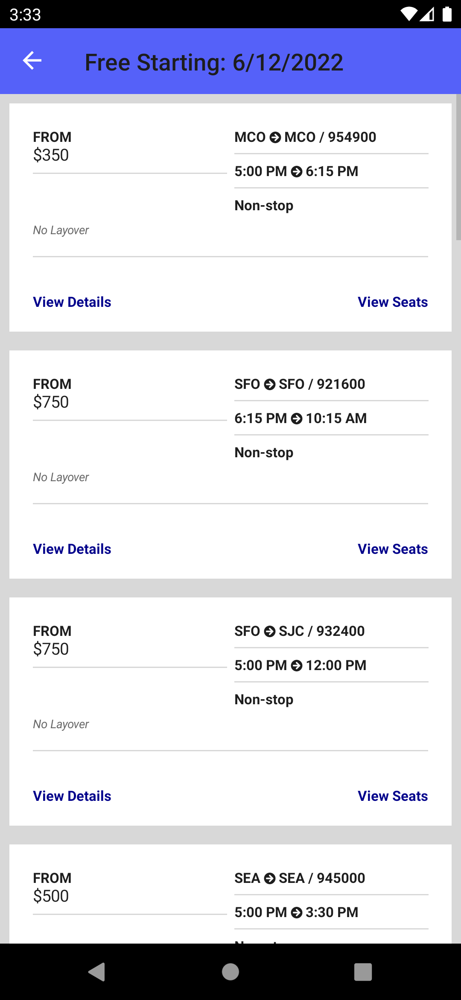
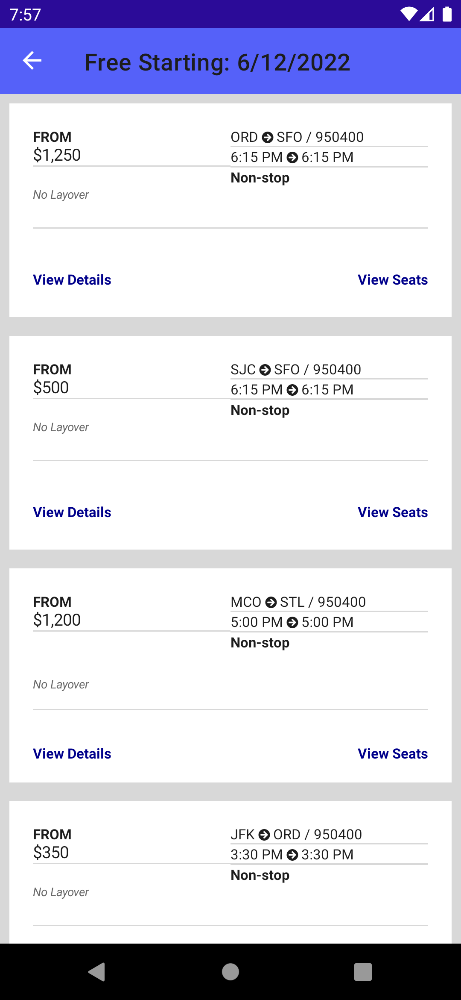

# FlyMe Sample App

This is a .NET MAUI sample app upgraded from Xamarin.Forms.

| Xamarin.Forms | .NET MAUI | Comments |
|:----:|:----:|:-------:|
|  |  | I had to change the VerticalOptions on the StackLayout from Center to Start in order for it to render properly |
|  |  | |
|  |  | With flyout disabled, I cannot see the items. |
|  |  | After enabling the flyout, I can see items. The VSM isn't working like it does in Forms. |
|  |  | The layout stops rendering at a certain point in .NET MAUI. |
|  |  | Padding or spacing is off in .NET MAUI version. Defaults? |
|  |  | Button casing changed. |
|  |  | Padding and spacing. Defaults? |
|  |  | Colors and border and padding. |
|  |  | Rounded bars. Carousel starting position. The bottom button isn't displaying and can't scroll to it. |